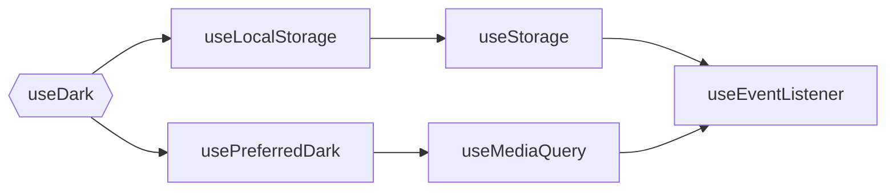

# 可组合的 Vue

Composable Vue,
编写可组合可复用的 Vue 函数的最佳实践与技巧

<div class="abs-tr !mx-5 !my-8 flex flex-col">
  
</div>

<div class="abs-bl !mx-14 my-12 flex flex-col">
  <div class="mb-3 uppercase tracking-widest font-500">
  Anthony Fu
  </div>
  <div class="text-md opacity-50">Hangzhou, China 2021</div>
</div>

<style>
p {
  @apply text-xl;
}
</style>

---
layout: intro
---

# Anthony Fu

<div class="leading-8 opacity-80">
Vue 核心成员 / Vite 团队成员<br>
VueUse, Slidev, Type Challenges 等项目创作者<br>
全职开源<br>
</div>

<div class="my-10 grid grid-cols-[40px,1fr] w-max gap-y-4">
  <ri-github-line class="opacity-50"/>
  <div><a href="https://github.com/antfu" target="_blank">antfu</a></div>
  <ri-twitter-line class="opacity-50"/>
  <div><a href="https://twitter.com/antfu7" target="_blank">antfu7</a></div>
  <ri-zhihu-line class="opacity-50"/>
  <div><a href="https://www.zhihu.com/people/Anthony117" target="_blank">Anthony Fu</a></div>
  <ri-user-3-line class="opacity-50"/>
  <div><a href="https://antfu.me" target="_blank">antfu.me</a></div>
  <ri-download-line class="opacity-50"/>
  <div><a href="https://talks.antfu.me/2021/vueconf-china" target="_blank">talks.antfu.me/2021/vueconf-china</a></div>
</div>


---
name: Sponsors
layout: center
---

<br>
<div class="text-center text-xs opacity-50 -mt-8 hover:opacity-100">
  <a href="https://github.com/sponsors/antfu" target="_blank">
    在 GitHub 上赞助我
  </a>
</div>

---
layout: center
class: text-center
---

# Vue Composition API

组合式 API

---
clicks: 5
---

# 什么是组合式 API?

在 Vue 3 中引入的一种新的编写 Vue 组件的方式。

<div class="grid grid-cols-2 gap-x-4">

```html {all|3,7,8,12,13,17|4-6|8-12|13-17|all} {at:0}
<script>
export default {
  data() {
    return {
      dark: false
    }
  },
  computed: {
    light() {
      return !this.dark
    }
  },
  methods: {
    toggleDark() {
      this.dark = !this.dark
    }
  }
}
</script>
```

```html {all|5,16|6,10|7,11|12-14|all} {at:0}
<script>
import { ref, computed } from 'vue'

export default {
  setup() {
    const dark = ref(false)
    const light = computed(() => !dark.value)

    return {
      dark,
      light,
      toggleDark() {
        dark.value = !dark.value
      }
    }
  }
}
</script>
```

</div>

---
clicks: 6
---

# 为什么引入组合式 API ？

<div class="grid grid-cols-2 gap-x-4 gap-y-4">

###### 对象式 API 存在的问题

###### 组合式 API 提供的能力

<v-clicks at="1">

- 不利于复用
- 潜在命名冲突
- 上下文丢失
- 有限的类型支持
- 按 API 类型组织

</v-clicks>

<v-clicks at="1">

- 极易复用 (原生 JS 函数)
- 可灵活组合 (生命周期钩子可多次使用)
- 提供更好的上下文支持
- 更好的 TypeScript 类型支持
- 按功能/逻辑组织
- 可独立于 Vue 组件使用

</v-clicks>

</div>

---

# 什么是可组合的函数

可复用逻辑的集合，专注点分离

<div class="grid grid-cols-[1fr,130px]">

```ts {all|2,3|5-15|all}
export function useDark(options: UseDarkOptions = {}) {
  const preferredDark = usePreferredDark() // <--
  const store = useLocalStorage('vueuse-dark', 'auto') // <--

  return computed<boolean>({
    get() {
      return store.value === 'auto'
        ? preferredDark.value
        : store.value === 'dark'
    },
    set(v) {
      store.value = v === preferredDark.value
        ? 'auto'
        : v ? 'dark' : 'light'
    },
  })
}
```

<div class="grid">
<DarkToggle class="m-auto"/>
</div>

</div>

<div v-click class="abs-b mx-14 my-12">
  <VueUse :names="['usePreferredDark', 'useLocalStorage', 'useDark']"/>
</div>

---

# 组合关系



<div v-click class="mt-6">

- 其中每一个函数都可以独立使用
- 专注点分离

</div>

---

# 建立"连结" <MarkerPattern />

不同于 React，Vue 的 `setup()` 只会在组件建立时执行**一次**，并建立数据与逻辑之间的连结。

- 建立 输入 → 输出 的连结
- 输出会自动根据输入的改变而改变

<div class="grid grid-cols-[auto,1fr] gap-4">
  <Connections v-click class="mt-4"/>
  <div v-click class="p-4">
    <h3 class="pb-2">Excel 中的公式</h3>
    
  </div>
</div>

---
layout: center
class: text-center
---

# 模式和技巧

编写可复用，可组合的逻辑

---
name: VueUse
layout: center
---

<div class="grid grid-cols-[3fr,2fr] gap-4">
  <div class="text-center pb-4">
    
    <div class="opacity-50 mb-2 text-sm">
      Vue 组合式 API 工具包
    </div>
    <div class="text-center">
      <a class="!border-none" href="https://www.npmjs.com/package/@vueuse/core" target="__blank"></a>
      <a class="!border-none" href="https://www.npmjs.com/package/@vueuse/core" target="__blank"></a>
      <a class="!border-none" href="https://vueuse.org" target="__blank"></a>
      
      <br>
      <a class="!border-none" href="https://github.com/vueuse/vueuse" target="__blank"></a>
    </div>
  </div>
  <div class="border-l border-gray-400 border-opacity-25 !all:leading-12 !all:list-none my-auto">

  - 同时兼容 Vue 2 和 Vue 3
  - Tree-shakeable ESM
  - TypeScript
  - CDN 兼容
  - 核心包含 110+ 组合式函数
  - 丰富的生态系统 8+ 扩展包

  </div>
</div>

---

<div class="grid grid-cols-2 gap-x-4"><div>

# Ref

```ts {monaco} {height: '155px'}
import { ref } from 'vue'

let foo = 0
let bar = ref(0)

foo = 1
bar = 1 // ts-error
```

<div class="mt-4" v-click>

###### Pros

- 显式调用，类型检查
- 相比 Reactive 局限更少

###### Cons

- `.value`

</div>

</div><div>

# Reactive

```ts {monaco} {height: '155px'}
import { reactive } from 'vue'

const foo = { prop: 0 }
const bar = reactive({ prop: 0 })

foo.prop = 1
bar.prop = 1
```

<div class="mt-4" v-click>

###### Pros

- 自动 Unwrap (即不需要 `.value`)

###### Cons

- 在类型上和一般对象没有区别
- 使用 ES6 解构会使响应性丢失
- 需要使用箭头函数包装才能使用 `watch`

</div>
</div></div>

---

# Ref 自动解包 <MarkerCore />

在众多情况下，我们可以减少 `.value` 的使用

<div class="grid grid-cols-[320px,1fr] gap-x-4 gap-y-2 pt-4">

<v-clicks :every='2'>

- `watch` 直接接受 Ref 作为监听对象，并在回调函数中返回解包后的值

```ts
const counter = ref(0)

watch(counter, (count) => {
  console.log(count) // same as `counter.value`
})
```

- Ref 在模版中自动解包

```html
<template>
  <button @click="counter += 1">
    Counter is {{ counter }}
  </button>
</template>
```

- 使用 Reactive 解包嵌套的 Ref

<div>

```ts
import { reactive, ref } from 'vue'
const foo = ref('bar')
const data = reactive({ foo, id: 10 })
data.foo // 'bar'
```

</div>

</v-clicks>

</div>

---

# `unref` - Ref 的反操作 <MarkerCore />

- 如果传入一个 Ref，返回其值
- 否则原样返回

<div class="grid grid-cols-2 gap-x-4 mt-4">

<div v-click>

###### 实现

```ts
function unref<T>(r: Ref<T> | T): T {
  return isRef(r) ? r.value : r
}
```

</div><div v-click>

###### 使用

```ts {monaco}
import { ref, unref } from 'vue'

const foo = ref('foo')
unref(foo) // 'foo'

const bar = 'bar'
unref(bar) // 'bar'
```

</div></div>

---

# 接受 Ref 作为函数参数 <MarkerPattern />

<div class="grid grid-cols-[160px,1fr,220px] gap-x-4">

<div />

###### 实现

###### 用例

<v-clicks :every='3'>

<div class="my-auto leading-6 text-base opacity-75">
纯函数
</div>

```ts
function add(a: number, b: number) {
  return a + b
}
```

```ts
const a = 1
const b = 2

const c = add(a, b) // 3
```

<div class="my-auto leading-6 text-base opacity-75">
接受 Ref 作为参数，<br>
返回一个响应式的结果
</div>

```ts
function add(a: Ref<number>, b: Ref<number>) {
  return computed(() => a.value + b.value)
}
```

```ts
const a = ref(1)
const b = ref(2)

const c = add(a, b)
c.value // 3
```

<div class="my-auto leading-6 text-base opacity-75">
同时接受传入值和 Ref
</div>

```ts
function add(
  a: Ref<number> | number,
  b: Ref<number> | number
) {
  return computed(() => unref(a) + unref(b))
}
```

```ts
const a = ref(1)

const c = add(a, 5)
c.value // 6
```

</v-clicks>

</div>

---

# MaybeRef 类型工具 <MarkerTips/>

```ts
type MaybeRef<T> = Ref<T> | T
```

<v-clicks>

在 VueUse 中我们大量地使用 `MaybeRef` 来支持可选择性的响应式参数

```ts
export function useTimeAgo(
  time: Date | number | string | Ref<Date | number | string>,
) {
  return computed(() => someFormating(unref(time)))
}
```

```ts
import { Ref, computed, unref } from 'vue'

type MaybeRef<T> = Ref<T> | T

export function useTimeAgo(
  time: MaybeRef<Date | number | string>,
) {
  return computed(() => someFormating(unref(time)))
}
```

</v-clicks>

---

# 让你的函数变得更灵活 <MarkerPattern />

就像乐高，让你的函数可以适应不同的使用场景。

<div class="grid grid-cols-2 gap-x-4">

<div v-click>

###### 构造一个 "特殊的" Ref

```ts
import { useTitle } from '@vueuse/core'

const title = useTitle()

title.value = 'Hello World'
// 网页的标题随 Ref 改变
```

</div><div v-click>

###### 绑定上一个现有的 Ref

```ts
import { computed, ref } from 'vue'
import { useTitle } from '@vueuse/core'

const name = ref('Hello')
const title = computed(() => {
  return `${name.value} - World`
})

useTitle(title) // Hello - World

name.value = 'Hi' // Hi - World
```

</div></div>

<div v-click class="abs-b mx-14 my-12">
<VueUse name="useTitle"/>
</div>

---

# `useTitle` <Marker class="text-blue-400">用例</Marker>

`useTitle` 的实现

<div class="grid grid-cols-[450px,1fr] gap-4">
<v-clicks>

```ts {monaco}
import { ref, watch } from 'vue'
import { MaybeRef } from '@vueuse/core'

export function useTitle(
  newTitle: MaybeRef<string | null | undefined>
) {
  const title = ref(newTitle || document.title)

  watch(title, (t) => {
    if (t != null)
      document.title = t
  }, { immediate: true })

  return title
}
```

```html

<-- 1. 重复使用用户提供的 Ref, 或者建立一个新的

<-- 2. 将页面标题与 Ref 进行同步

```

</v-clicks>
</div>

---

# 重复使用已有 Ref <MarkerCore />

<v-clicks>

如果将一个 `ref` 传递给 `ref()` 构造函数，它将会原样将其返回。

```ts
const foo = ref(1) // Ref<1>
const bar = ref(foo) // Ref<1>

foo === bar // true
```

```ts
function useFoo(foo: Ref<string> | string) {
  // 不需要额外操作
  const bar = isRef(foo) ? foo : ref(foo)

  // 与上面的代码等效
  const bar = ref(foo)

  /* ... */
}
```

这个技巧在编写不确定参数类型的函数时十分有用。

</v-clicks>

---

# `ref` / `unref` <MarkerTips />

<div v-click>

- `MaybeRef<T>` 可以很好的配合 `ref` 和 `unref` 进行使用。
- 使用 `ref()` 当你想要想要将其标准化为 Ref
- 使用 `unref()` 当你想要获得其值

<br>

```ts
type MaybeRef<T> = Ref<T> | T

function useBala<T>(arg: MaybeRef<T>) {
  const reference = ref(arg) // 得到 ref
  const value = unref(arg) // 得到值
}
```

</div>

---

# 由 Ref 组成的对象 <MarkerPattern />

以在使用可组合的函数式，同时获得 `ref` 和 `reactive` 的好处。

<div class="mt-1" />
<div class="grid grid-cols-2 gap-x-4">
<v-clicks>

```ts {monaco}
import { reactive, ref } from 'vue'

function useMouse() {
  return {
    x: ref(0),
    y: ref(0)
  }
}

const { x, y } = useMouse()
const mouse = reactive(useMouse())

mouse.x === x.value // true
```

<div class="px-2 py-4">

- 可以直接使用 ES6 解构其中的 Ref 使用
- 根据使用方式，当想要自动解包的功能时，可以使用 `reactive` 将其转换为对象

</div>

</v-clicks>
</div>

---

# 将异步操作转换为 “同步” <MarkerTips />

使用组合式 API, 我们甚至可以将异步请求转换为 “同步” 的

<div v-click>

###### 异步

```ts
const data = await fetch('https://api.github.com/').then(r => r.json())

// use data
```

</div>
<div v-click>

###### 组合式 API

```ts
const { data } = useFetch('https://api.github.com/').json()

const user_url = computed(() => data.value?.user_url)
```

</div>
<div v-click>

先建立数据间的“连结”，然后再等待异步请求返回将数据填充。概念和 React 中的 SWR (stale-while-revalidate) 类似。

</div>

---

# `useFetch` <Marker class="text-blue-400">用例</Marker>

<v-click>

```ts
export function useFetch<R>(url: MaybeRef<string>) {
  const data = shallowRef<T | undefined>()
  const error = shallowRef<Error | undefined>()

  fetch(unref(url))
    .then(r => r.json())
    .then(r => data.value = r)
    .catch(e => error.value = e)

  return {
    data,
    error
  }
}
```

</v-click>

<div v-click class="abs-b mx-14 my-12">
<VueUse name="useFetch"/>
</div>

---

# 副作用自动清除 <MarkerPattern />

Vue 中原生的 `watch` 和 `computed` API 会在组件销毁时自动解除其内部的依赖监听。<br>
我们可以编写我们的函数时，遵循同样的模式。

<div v-click>

```ts {monaco}
import { onUnmounted } from 'vue'

export function useEventListener(target: EventTarget, name: string, fn: any) {
  target.addEventListener(name, fn)

  onUnmounted(() => {
    target.removeEventListener(name, fn) // <--
  })
}
```

</div>

<div v-click class="abs-b mx-14 my-12">
<VueUse name="useEventListener"/>
</div>

---

# `effectScope` RFC <Marker class="text-purple-400">即将到来</Marker>

一个新的 API 用于自动收集副作用，计划在 Vue 3.2 中引入<br>

```ts
// 在函数在 Scope 内创建的 effect, computed, watch, watchEffect 等将会被自动收集

const scope = effectScope(() => {
  const doubled = computed(() => counter.value * 2)

  watch(doubled, () => console.log(double.value))

  watchEffect(() => console.log('Count: ', double.value))
})

// 清除 Scope 内的所有 Effect
stop(scope)
```

详见 https://github.com/vuejs/rfcs/pull/212

---
disabled: true
---

# Template Ref <MarkerTips />

To get DOM element, you can pass a ref to it, and it will be available after component mounted

<div v-click>

```ts {monaco}
import { defineComponent, onMounted, ref } from 'vue'
export default defineComponent({
  setup() {
    const element = ref<HTMLElement | undefined>()

    onMounted(() => {
      element.value // now you have it
    })

    return { element }
  }
})
```

```html {monaco}
<template>
  <div ref="element"><!-- ... --></div>
</template>
```

</div>

---
disabled: true
---

# Template Ref <MarkerTips />

Use `watch` instead of `onMounted` to unify the handling for template ref changes.

<div>
<v-click>

```ts {monaco}
import { defineComponent, ref, watch } from 'vue'
export default defineComponent({
  setup() {
    const element = ref<HTMLElement | undefined>()

    watch(element, (el) => {
      // clean up previous side effect
      if (el) {
        // use the DOM element
      }
    })

    return { element }
  }
})
```

</v-click>
</div>

---

# 类型安全的 Provide / Inject <MarkerCore/>

使用 Vue 提供的 `InjectionKey<T>` 类型工具来在不同的上下文中共享类型。

<div v-click>

```ts {monaco}
// context.ts
import { InjectionKey } from 'vue'

export interface UserInfo {
  id: number
  name: string
}

export const injectKeyUser: InjectionKey<UserInfo> = Symbol('user')
```

</div>

---

# 类型安全的 Provide / Inject <MarkerCore/>

从同一个模组中为 `provide` 和 `inject` 引入相同的 Key

<div class="grid grid-cols-2 gap-4">
<v-clicks>

```ts {monaco}
// parent.vue
import { provide } from 'vue'
import { injectKeyUser } from './context'

export default {
  setup() {
    provide(injectKeyUser, {
      id: '7', // 类型错误
      name: 'Anthony'
    })
  }
}
```

```ts {monaco}
// child.vue
import { inject } from 'vue'
import { injectKeyUser } from './context'

export default {
  setup() {
    const user = inject(injectKeyUser)
    // UserInfo | undefined

    if (user)
      console.log(user.name) // Anthony
  }
}
```

</v-clicks>
</div>

---

# 状态共享 <MarkerPattern />

由于组合式 API 天然提供的灵活性，状态可以独立于组件被创建并使用。

<div class="grid grid-cols-2 gap-4">

<v-click>

```ts
// shared.ts
import { reactive } from 'vue'

export const state = reactive({
  foo: 1,
  bar: 'Hello'
})
```

</v-click>

<div>
<v-clicks>

```ts
// A.vue
import { state } from './shared.ts'

state.foo += 1
```

```ts
// B.vue
import { state } from './shared.ts'

console.log(state.foo) // 2
```

</v-clicks>
</div>
</div>

<h3 v-click class="opacity-100">⚠️ 此方案不兼容 SSR!</h3>

---

# 兼容 SSR 的状态共享 <MarkerPattern />

使用 `provide` 和 `inject` 来共享应用层面的状态。

<div class="grid grid-cols-[max-content,1fr] gap-4">

<v-click>

```ts
export const myStateKey: InjectionKey<MyState> = Symbol('myState')

export function createMyState() {
  const state = {
    /* ... */
  }

  return {
    install(app: App) {
      app.provide(myStateKey, state)
    }
  }
}

export function useMyState(): MyState {
  return inject(myStateKey)!
}
```

</v-click>

<div>
<v-clicks>

```ts
// main.ts
const App = createApp(App)

app.use(createMyState())
```

```ts
// A.vue

// 在任何组件中使用这个函数来获得状态对象
const state = useMyState()
```

<div class="my-3">

- [Vue Router v4](https://github.com/vuejs/vue-router-next) 也使用的类似的方式
  - `createRouter()`
  - `useRouter()`

</div>

</v-clicks>
</div>

</div>

---

# useVModel <MarkerTips />

一个让使用 props 和 emit 更加容易的工具

<div class="grid grid-cols-2 gap-4">

<v-click>

```ts
export function useVModel(props, name) {
  const emit = getCurrentInstance().emit

  return computed({
    get() {
      return props[name]
    },
    set(v) {
      emit(`update:${name}`, v)
    }
  })
}
```

</v-click>

<div>

<v-click>

```ts
export default defineComponent({
  setup(props) {
    const value = useVModel(props, 'value')

    return { value }
  }
})
```

</v-click>
<br>
<v-click>

```html
<template>
  <input v-model="value" />
</template>
```

</v-click>
</div>
</div>

<div v-click class="abs-b mx-14 my-12">
<VueUse name="useVModel"/>
</div>

---
disabled: true
---

# useVModel (Passive) <MarkerTips />

Make the model able to be updated **independently** from the parent logic

<v-click>

```ts
export function usePassiveVModel(props, name) {
  const emit = getCurrentInstance().emit
  const data = ref(props[name]) // store the value in a ref

  watch(() => props.value, v => data.value = v) // sync the ref whenever the prop changes

  return computed({
    get() {
      return data.value
    },
    set(v) {
      data.value = v // when setting value, update the ref directly
      emit(`update:${name}`, v) // then emit out the changes
    }
  })
}
```

</v-click>

---
layout: center
---

# 以上所述，均可使用于 Vue 2 和 3

---

# `@vue/composition-api` <Marker class="text-teal-400">库</Marker>

为 Vue 2 提供组合式 API 的插件。<br><carbon-logo-github class="inline-block"/> [vuejs/composition-api](https://github.com/vuejs/composition-api)

```ts
import Vue from 'vue'
import VueCompositionAPI from '@vue/composition-api'

Vue.use(VueCompositionAPI)
```

```ts
import { reactive, ref } from '@vue/composition-api'
```

---

# Vue 2.7 <Marker class="text-purple-400">即将到来</Marker>

[Vue 2.7 计划](https://github.com/vuejs/rfcs/blob/ie11/active-rfcs/0000-vue3-ie11-support.md#for-those-who-absolutely-need-ie11-support)

- 将 `@vue/composition-api` 整合进 Vue 2 的核心
- 在 SFC 中 `<script setup>` 支持语法
- 将 Vue 2 代码库迁移到 TypeScript
- Vue 2 将继续支持 IE11
- LTS

---

# Vue Demi <Marker class="text-teal-400">库</Marker>

创建 Vue 2 和 3 兼容的插件/库<br><carbon-logo-github class="inline-block"/> [vueuse/vue-demi](https://github.com/vueuse/vue-demi)

```ts
// same syntax for both Vue 2 and 3
import { defineComponent, reactive, ref } from 'vue-demi'
```


---

# 快速回顾

- 建立 “连结”
- 接受 Ref 作为函数参数
- 返回由 Ref 组成的对象
- 使用 ref / unref 让函数变得更加灵活
- 将异步操作转换为 “同步”
- 副作用自动清除
- 类型安全的 Provide / Inject
- 状态共享
- `useVModel`

---
layout: center
class: 'text-center pb-5 :'
---

# 谢谢！

幻灯片可以在我的网站 [antfu.me](https://antfu.me) 上下载
