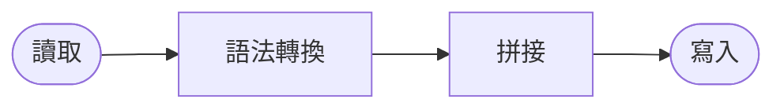
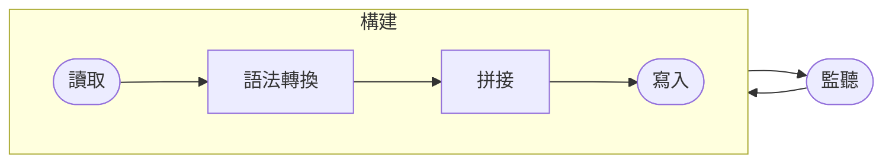

# New Ways to Vue

<p text="2xl" class="!leading-8">
新技術和工具如何影響我們編寫 Vue 專案的方式
</p>

<div class="uppercase tracking-widest" m="t-10">
Anthony Fu
</div>

<div class="abs-tr mx-14 my-3 flex-col text-right">
  
  <div class="text-sm opacity-50">Oct. 17th, 2021</div>
</div>

---
layout: 'intro'
---

<h1 text="!5xl">Anthony Fu</h1>

<div class="leading-8 opacity-80">
Vue & Vite 核心團隊成員<br>
Slidev, VueUse, Vitesse, Type Challenges 等項目作者<br>
狂熱的開源愛好者，目前任職於 <a href="https://nuxtlabs.com" target="_blank">NuxtLabs</a>。<br>
</div>

<div class="my-10 grid grid-cols-[40px,1fr] w-min gap-y-4">
  <ri-github-line class="opacity-50"/>
  <div><a href="https://github.com/antfu" target="_blank">antfu</a></div>
  <ri-twitter-line class="opacity-50"/>
  <div><a href="https://twitter.com/antfu7" target="_blank">antfu7</a></div>
  <ri-user-3-line class="opacity-50"/>
  <div><a href="https://antfu.me" target="_blank">antfu.me</a></div>
</div>


---
name: Sponsors
layout: center
---

<br>
<div class="text-center text-xs opacity-50 -mt-12 hover:opacity-100">
  <a href="https://github.com/sponsors/antfu" target="_blank">
    在 GitHub 上贊助我
  </a>
</div>

---
layout: center
---

# New Ways to Vue <logos-vue />

---

# Vue 2 中的編寫方式

<div grid="~ cols-2" class="gap-10">

```html
<script>
import Vue from 'vue'
import Foo from './components/Foo.vue'
import { mixinBar } from './mixins/bar'

export default Vue.extend({
  components: {
    Foo,
    // ...
  },
  mixins: {
    mixinBar,
    // ...
  },
  props: {
    value: {
      type: String
    },
    // ...
  },
  data() {
    return {
      // ...
    }
  },
  methods: {
    // ...
  },
  created() {
    // ...
  },
  destroyed() {
    // ...
  }
})
</script>
```

<div>

###### 存在的問題

<v-clicks>

- "腳手架程式碼"
- 可擴展性
- TypeScript 支援

</v-clicks>

</div>

</div>

---
clicks: 3
---

# 組合式 API

<div grid="~ cols-2 gap-x-4 gap-y-2">

###### 物件式 API
###### 組合式 API

```js {all|all|2,8,12,16}
export default {
  data() {
    return {
      dark: false,
      media: matchMedia('(prefers-color-scheme: dark)')
    }
  },
  methods: {
    toggleDark() { this.dark = !this.dark },
    update() { this.dark = this.media.matches }
  },
  created() {
    this.media.addEventListener('change', this.update)
    this.update()
  },
  destroyed() {
    this.media.removeEventListener('change', this.update)
  }
}
```

<div v-show="$clicks >= 1">

```js {*|*|3|3,11} {at:0}
import { onUnmounted, ref } from 'vue'
export default {
  setup() {
    const media = matchMedia('(prefers-color-scheme: dark)')
    const dark = ref(media.matches)

    const update = () => dark.value = media.matches
    const toggleDark = () => dark.value = !dark.value

    media.addEventListener('change', update)
    onUnmounted(() => {
      media.removeEventListener('change', update)
    })

    return { dark, toggleDark }
  }
}
```

</div>

</div>

---
clicks: 2
---

# 可組合性

<div grid="~ cols-2 gap-x-2">

<div>
<div v-show="$clicks < 2">

```html
<!-- DarkToggle.vue -->
<script>
import { ref, onUnmounted } from 'vue'

export default {
  setup() {
    const media = matchMedia('(prefers-color-scheme: dark)')
    const dark = ref(media.matches)

    const update = () => dark.value = media.matches
    const toggleDark = () => dark.value = !dark.value

    media.addEventListener('change', update)
    onUnmounted(() => {
      media.removeEventListener('change', update)
    })

    return { dark, toggleDark }
  }
}
</script>
```

</div>
<div v-show="$clicks >= 2">

```html
<!-- DarkToggle.vue -->
<script>
import { useDark } from './useDark'

export default {
  setup() {
    return {
      ...useDark()
    }
  }
}
</script>
```

</div>
</div>

<div v-show="$clicks >= 1">

```ts
// useDark.js
import { onUnmounted, ref } from 'vue'

export function useDark() {
  const media = matchMedia('(prefers-color-scheme: dark)')
  const dark = ref(media.matches)

  const update = () => dark.value = media.matches
  const toggleDark = () => dark.value = !dark.value

  media.addEventListener('change', update)
  onUnmounted(() => {
    media.removeEventListener('change', update)
  })
  return { dark, toggleDark }
}
```

</div>

</div>

---

# `<script setup>` 語法

<div grid="~ cols-2 gap-x-4 gap-y-2">

##### `<script>`

##### `<script setup>`

```html {all|3,9-14}
<script>
import { ref, computed } from 'vue'
import MyButton from './MyButton.vue'
export default {
  components: {
    MyButton,
  },
  setup() {
    const counter = ref(0)
    const doubled = computed(() => counter.value * 2)

    function inc() {
      counter.value += 1
    }

    return { counter, doubled, inc }
  }
}
</script>
```

<div v-show="$clicks > 0">

```html
<script setup>
import { ref, computed } from 'vue'
import MyButton from './MyButton.vue'

const counter = ref(0)
const doubled = computed(() => counter.value * 2)

function inc() {
  counter.value += 1
}
</script>
```

<div p="y-4 x-2">

- 頂層變數和函式宣告
- 變數和組件將直接可以在模板中使用
- Vue 3.2 中已穩定

</div>

</div>

</div>

---
clicks: 2
---

# `<style>` 中的 `v-bind()` 語法

<div grid="~ cols-2 gap-x-4 gap-y-2">

###### without

###### with v-bind()

```html {*|*|2,9-13} {at: 0}
<template>
  <button :style="{ color: buttonColor }">
    My Button
  </button>
</template>

<script>
export default {
  data() {
    return {
      buttonColor: 'green'
    }
  }
}
</script>

<style>
button {
  border-radius: 4px;
}
</style>
```

<div v-show="$clicks >= 1">

```html {*|*|6,12} {at: 0}
<template>
  <button>My Button</button>
</template>

<script setup>
const buttonColor = ref('green')
</script>

<style>
button {
  border-radius: 4px;
  color: v-bind(buttonColor);
}
</style>
```

</div>
</div>

---
disabled: true
---

# Ref 語法糖 <sup opacity="75">in RFC</sup>

<div grid="~ cols-2 gap-x-4 gap-y-2">

###### 關閉

###### 開啟

```js
import { computed, ref } from 'vue'

const count = ref(0)
const double = computed(() => count.value * 2)

function inc() {
  count.value = count.value + 1
}
```

```js
let count = $ref(0)
const double = $computed(() => count * 2)

function inc() {
  count++
}
```

</div>

<div pt="10"></div>

- 使用 `$()` 宣告響應式的變數 (`引用 -> 變數`)
- 使用 `$$()` 獲得響應式變數對應的 Ref (`變數 -> 引用`)
- 提供了常用 API 的簡寫 (`$ref`, `$computed` 和 `$shallowRef` 等)

<div pt="6"></div>

詳情請參閱 [RFC](https://github.com/vuejs/rfcs/discussions/369)

---
layout: center
class: text-center
---

# 全新的默認開發工具 Vite

<div text="center 9xl" m="t-8">
  <logos-vitejs /> + <logos-vue class="transform translate-y-6px" m="-l-2"/>
</div>

---
layout: center
---

# Vite 是什麼？

---
disabled: true
---

# 任務執行器 Task Runners

<div flex="~" position="absolute top-10 right-10" gap="4" text="center">
<div flex="~ col">
<logos-gulp text="5xl" m="auto b-2"/>
Gulp
</div>
<div flex="~ col">
<logos-grunt text="5xl" m="auto b-2"/>
Grunt
</div>
</div>

<v-click>

###### 構建 (Build)

通常被設計成單指令構建



<div m="t-8"/>
</v-click>
<v-click>

###### 檔案監聽 (Watch)

監聽檔案改動後 **重新執行整個構建過程**。<br>需要重新整理頁面才會生效。



</v-click>

---
disabled: true
---

# 打包器 Bundlers

<div flex="~" position="absolute top-10 right-10" gap="4" text="center">
<div flex="~ col">
<logos-webpack text="5xl" m="auto b-2"/>
Webpack
</div>
<div flex="~ col">
<logos-rollup text="5xl" m="auto b-2"/>
Rollup
</div>
</div>

<div mt="10" />

- 可以聰明地知道模組間的依賴關係
- 重新構建時，沒有改變的模組可以被緩存

<v-click>
<div m="t-8"/>

###### 構建優先 Build First

- 需要先打包整個專案才能讓開發伺服器啟動
- 模塊熱更新（HMR）隨著項目變大而顯著變慢

</v-click>

---

# 打包器 Bundlers

<div flex="~" position="absolute top-10 right-10" gap="4" text="center">
<div flex="~ col">
<logos-webpack text="5xl" m="auto b-2"/>
Webpack
</div>
<div flex="~ col">
<logos-rollup text="5xl" m="auto b-2"/>
Rollup
</div>
</div>

<div m="t-8"/>

<div class="grid grid-cols-[300px,1fr] gap-4">
<div v-click>

###### 構建優先 Build First

- 主要為生產環境構建設計
- 需要先打包整個專案才能讓開發伺服器啟動
- 需要複雜的配置
- 模塊熱更新（HMR）隨著項目變大而顯著變慢

</div>


</div>

---

# 開發用伺服器 Dev Server

<div flex="~" position="absolute top-10 right-10" gap="4" text="center">
<div flex="~ col">
<logos-snowpack text="5xl" m="auto b-2" dark="filter invert" />
Snowpack
</div>
<div flex="~ col">
<logos-vitejs text="5xl" m="auto b-2"/>
Vite
</div>
</div>

<div m="t-8"/>
<div class="grid grid-cols-[300px,1fr]">
<div v-click>

###### 開發優先 Dev First

- 專為前端開發設計
- 不打包 + 使用原生 ESM
- 按需編譯
- 伺服器瞬間準備完成
- 瞬間的熱更新 HMR
- ...更多新功能

</div>


</div>

---
layout: center
---

# Vue 3 和 Vite 給我們帶來了什麼？

<p v-click>更快的速度和更好的開發體驗</p>

---
layout: center
---

# New Ways to View <twemoji-eyes />

---
clicks: 4
---

# 使用組件

<div grid="~ cols-2 gap-x-8">

```html {*|9-12|14-19|1-7|*}
<template>
  <my-container>
    <my-button />
    <my-input />
  </my-container>
</template>

<script>
import MyContainer from '../components/MyContainer.vue'
import MyButton from '../components/MyButton.vue'
import MyInput from '../components/MyInput.vue'

export default {
  components: {
    MyContainer,
    MyButton,
    MyInput,
  }
}
</script>
```

<div>

<div v-if="$clicks >= 1">

###### 要使用一個組件

<v-clicks fade :at="1">

- 使用 `import` 導入，並取一個名字
- 註冊組件
- 在模板中使用它

</v-clicks>

</div>
<div v-if="$clicks >= 4">

###### 問題

- 冗余
- 組件的名字至少被重複了四次

</div>
</div>
</div>

---

# 使用組件

<div grid="~ cols-2 gap-x-8">

```html
<template>
  <my-container>
    <my-button />
    <my-input />
  </my-container>
</template>

<script setup>
import MyContainer from '../components/MyContainer.vue'
import MyButton from '../components/MyButton.vue'
import MyInput from '../components/MyInput.vue'
</script>
```

<div>

<v-click>

###### 使用 `<script setup>` 語法

- 導入可以直接在模板中使用
- 不再需要註冊組件

</v-click>
<v-click>

###### 但是...

- 組件的名字還是被重複了三次

</v-click>

</div>
</div>

---

# 組件自動導入

<RepoFixed name="antfu/vite-plugin-components"/>

<div grid="~ gap-x-8" class="grid-cols-[300px,1fr]">

<div>

使用 <Repo name="antfu/vite-plugin-components" ml="1" hide-owner/>

```html
<template>
  <my-container>
    <my-button />
    <my-input />
  </my-container>
</template>
```

<br>

#### 收工！

</div>

<div>
<div v-click>

###### 怎麼做到的？

- **編譯期** 組件解析
- 在 `src/components` 資料夾下的組件將被自動導入

</div>
<div v-click>

###### 不同於全局組件註冊

- Code-splitting
- 不再需要手動註冊組件
- 跳過了運行時組件解析

</div>
</div>
</div>

---

# 編譯期解析

```html
<template>
  <my-container>
    <my-button />
    <my-input />
  </my-container>
</template>
```

<v-click>

將會被 `@vue/sfc-compiler` 編譯成 (可以通過 https://sfc.vuejs.org 查看)

```ts {all|3-5}
import { resolveComponent as _resolveComponent } from 'vue'
function render(_ctx, _cache) {
  const _component_my_button = _resolveComponent('my-button')
  const _component_my_input = _resolveComponent('my-input')
  const _component_my_container = _resolveComponent('my-container')

  return (_openBlock(), _createBlock(_component_my_container, null, {
    default: _withCtx(() => [
      _createVNode(_component_my_button),
      _createVNode(_component_my_input)
    ]),
    _: 1 /* STABLE */
  }))
}
```

</v-click>

---
clicks: 5
---

# 編寫一個 Vite 插件

<div grid="~ cols-2 gap-x-8">

```ts {*|5|6|7-8|10-16} {at: 0}
// vite.config.ts
export default {
  plugins: [{
    name: 'my-plugin',
    enforce: 'post',
    transform(code, id) {
      if (!id.endsWith('.vue'))
        return

      return code.replace(
        /_resolveComponent\("(.+?)"/g,
        (_, name) => {
          const component = findComponent(name)
          // 注入導入程式碼 (略)
          return component.path
        }
      )
    }
  }]
}
```

<div>

<v-clicks fade :at="1">

- 使用 `enforce: post` 確保在 Vue 編譯後執行
- 使用 `transform` 鉤子進行程式碼變換
- 過濾掉不是 Vue 的檔案
- 將 `_resolveComponent` 替換成直接導入的組件

</v-clicks>

<v-click :at="5">
<p p="t-4" opacity="75">
請參照 <a href="https://cn.vitejs.dev/guide/api-plugin.html" target="_blank">Vite Plugin API 官方文件</a>
</p>
</v-click>

</div>

</div>

---

# 最終結果

```ts {4-6}
import { resolveComponent as _resolveComponent } from 'vue'

function render(_ctx, _cache) {
  const _component_my_button = _resolveComponent('my-button')
  const _component_my_input = _resolveComponent('my-input')
  const _component_my_container = _resolveComponent('my-container')

  return () => { /* ... */ }
}
```

替換後產物

```ts {2-4}
import { resolveComponent as _resolveComponent } from 'vue'
import _component_my_button from '../components/MyButton.vue'
import _component_my_input from '../components/MyInput.vue'
import _component_my_container from '../components/MyContainer.vue'

function render(_ctx, _cache) {
  return () => { /* ... */ }
}
```

---

# 檢閱模組樹 Inspect Module Graph

獲悉每次變換的中間狀態

<RepoFixed name="antfu/vite-plugin-inspect" />

<div class="rounded-md overflow-hidden" w="650px">
  <video preload="auto" controls class="w-full -m-1px border-none outline-none p-0" src="https://video.twimg.com/tweet_video/E-9hyKRUYAIYJbI.mp4" type="video/mp4"></video>
</div>

---

# API 自動導入

<RepoFixed name="antfu/unplugin-auto-import" />

類似的，我們也可以做到 API 自動導入

<div grid="~ cols-2 gap-4">

```html
<script setup>
import { ref, computed, watch } from 'vue'
import { debouncedWatch } from '@vueuse/core'

const counter = ref(0)
const doubled = computed(() => counter.value * 2)

debouncedWatch(counter, () => {
  console.log('counter changed')
})
</script>
```

```html
<script setup>
const counter = ref(0)
const doubled = computed(() => counter.value * 2)

debouncedWatch(counter, () => {
  console.log('counter changed')
})
</script>
```

</div>

---

# 使用圖標 Icons

<RepoFixed name="antfu/vite-plugin-icons" v-click="6"/>

<div class="grid grid-cols-[1fr,2fr]">
<div>

###### 以往的方式

<v-clicks>

- Icon Fonts
  - 需要打包整圖標集
  - FOUC (無樣式的閃爍)
- SVG
  - 需要手動引入
  - 無法根據上下文上色
- 圖標組件
  - 依賴於圖標集的實現
  - 需要手動註冊

</v-clicks>

</div>

<div>

<v-click>

###### 更好的解決方案？

</v-click>
<v-click>

<p text="sm" class="!-mb-4">

受啟發於 Vite 的 “按需分配” 理念，我們可以讓圖標在編譯期按需分配

</p>

```html
<script setup>
import MdiAlarm from '~icons/mdi/alarm'
import FaBeer from '~icons/fa/beer'
import TearsOfJoy from '~icons/twemoji/face-with-tears-of-joy'
</script>

<template>
  <MdiAlarm />
  <FaBeer style="color: orange"/>
  <TearsOfJoy/>
</template>
```

</v-click>
<v-click>

<p text="sm" class="!-mb-4">

透過 [Iconify](https://iconify.design/)，我們可以讓 100+ 圖標集的 10,000+ 圖標使用相同的語法導入

</p>

```js
import Icon from '~icons/[collection]/[id]'
```

<p text="sm" class="!-mb-4">

插件將會按需將虛擬模組編譯成對應的圖標組件

</p>

</v-click>

</div>
</div>

---
clicks: 1
---

# 圖標按需導入

<div my="5">

- 按需引入，只有用到的圖標才會被被打包
- 可以使用幾乎任何圖標
- 可直接使用 `class` 和 `style` 修改樣式
- SSR / SSG 友好
- 配合 `vite-plugin-components`，獲得類似 Icons Fonts 的體驗

</div>

<div v-if="$clicks == 0">

```html
<script setup>
import MdiAlarm from '~icons/mdi/alarm'
import FaBeer from '~icons/fa/beer'
import TearsOfJoy from '~icons/twemoji/face-with-tears-of-joy'
</script>

<template>
  <MdiAlarm />
  <FaBeer style="color: orange"/>
  <TearsOfJoy/>
</template>
```

</div>
<div v-else>

```html
<template>
  <MdiAlarm />
  <FaBeer style="color: orange"/>
  <TearsOfJoy/>
</template>
```

</div>

---
class: flex flex-col
---

<div grid="~ gap-10" h="full" class="grid-cols-[1.8fr,1fr]">
<div>

# Vite 生態系統

<div mt="5" />

<v-clicks>

<Repo name="antfu/vite-plugin-components" hide-owner/> - 組件自動引入

<Repo name="antfu/vite-plugin-auto-import" hide-owner/> - API 自動引入

<Repo name="antfu/vite-plugin-icons" hide-owner/> - 按需分配的圖標方案

<Repo name="antfu/vite-plugin-inspect" hide-owner/> - 檢視 Vite 內部狀態

<Repo name="hannoeru/vite-plugin-pages"/> - 檔案系統路由生成器

<Repo name="windicss/vite-plugin-windicss" hide-owner/> - Windi CSS (按需生成的 Tailwind CSS)

<Repo name="axe-me/vite-plugin-node" /> - 為後端 Node 應用提供 Vite HMR

<Repo name="anncwb/vite-plugin-style-import" /> - 按需引入組件樣式

<div mt="10">
...以及更多
</div>

</v-clicks>

</div>
<div flex="~" h="full">

<div flex="~ col" text="center" m="auto" v-click>


<Repo name="vitejs/awesome-vite" />

</div>
</div>
</div>

---
layout: center
class: text-center
---

# One more thing

---
layout: center
class: text-center
title: 把他們帶到你現有的專案中
---

<p opacity="50">Vite 的設計思想激發了很多新的工具和開發體驗</p>
<h1 v-click>把他們帶到你現有的專案中</h1>
<div v-click text="green-500 5xl">今天就行！</div>

---
layout: center
class: text-center
title: Introducing unplugin
---

<h1 text="!5xl">Introducing <b>unplugin</b></h1>

<h3 v-click opacity="60">通用化的插件 API，可用於 Webpack，Vite，Rollup 等等...</h3>

<v-click>

<h3 opacity="60" mt="10">編寫一次但適用於:</h3>

<div class="flex gap-5 text-5xl p-6 -mt-2 -mb-20 place-content-center">
  <logos-webpack text="1.1em" />
  <logos-vitejs />
  <logos-rollup />
  <logos-nuxt-icon />
  <logos-vue />
  <logos-nextjs-icon dark="filter invert" />
</div>

</v-click>

---

# Unplugin

<RepoFixed name="unjs/unplugin" />

<div class="grid grid-cols-2 gap-x-4 gap-y-2">

###### Vite 插件

###### Unplugin

```ts
export function VitePlugin() {
  return {
    name: 'my-first-unplugin',
    transform(code) {
      return code.replace(
        /<template>/,
        `<template><div>Injected</div>`
      )
    },
  }
}
```

```ts
import { createUnplugin } from 'unplugin'

export const unplugin = createUnplugin(() => {
  return {
    name: 'my-first-unplugin',
    transform(code) {
      return code.replace(
        /<template>/,
        `<template><div>Injected</div>`
      )
    },
  }
})

export const VitePlugin = unplugin.vite
export const RollupPlugin = unplugin.rollup
export const WebpackPlugin = unplugin.webpack
```

</div>

---

# Vite 插件 <carbon-arrow-right /> Unplugins

<v-clicks>

<div>
<code opacity="50">vite-plugin-components</code> <carbon-arrow-right /> <code text="green-400">unplugin-vue-components</code>
  <ul></ul>
</div>

<div>
<code opacity="50">vite-plugin-auto-import</code> <carbon-arrow-right /> <code text="green-400">unplugin-auto-import</code>
  <ul>For <logos-vue/> Vue / <logos-react/> React / <logos-svelte-icon/> Svelte / <logos-javascript/> Vanila / Any framework</ul>
</div>

<div>
<code opacity="50">vite-plugin-icons</code> <carbon-arrow-right /> <code text="green-400">unplugin-icons</code>

<ul class="grid grid-cols-[1fr,40px,1fr,40px,1fr] w-min whitespace-nowrap">

<div class="group">
  <div><logos-vue/> Vue</div>
  <div><logos-react/> React</div>
  <div><logos-preact/> Preact</div>
  <div><logos-svelte-icon/> Svelte</div>
  <div><solid-logo/> SolidJS</div>
  <div><logos-webcomponents/> Web Components</div>
  <div><logos-javascript/> Vanila</div>
  <div>...</div>
</div>
<carbon-add m="auto"/>

<div class="group">
  <div><logos-vitejs/> Vite</div>
  <div><logos-nuxt-icon/> Nuxt</div>
  <div><logos-nextjs-icon class="inline filter invert"/> Next.js</div>
  <div><logos-rollup/> Rollup</div>
  <div><logos-vue/> Vue CLI</div>
  <div><logos-webpack/> Webpack</div>
  <div>...</div>
</div>

<carbon-add m="auto"/>

<div class="group">
  <div><carbon-carbon/> <a href="https://carbondesignsystem.com/guidelines/icons/library/" target="_blank">Carbon Icons</a></div>
  <div><mdi-material-design/> <a href="https://materialdesignicons.com/" target="_blank">Material Design Icons</a></div>
  <div><uim-circle-layer/> <a href="https://iconscout.com/unicons" target="_blank">Unicons</a></div>
  <div><twemoji-star-struck/> <a href="https://github.com/twitter/twemoji" target="_blank">Twemoji</a></div>
  <div><tabler-writing-sign/> <a href="https://tabler-icons.io/" target="_blank">Tabler</a></div>
  <div><bx-bx-planet/> <a href="https://github.com/atisawd/boxicons" target="_blank">BoxIcons</a></div>
  <div><eos-icons:installing/> <a href="https://gitlab.com/SUSE-UIUX/eos-icons" target="_blank">EOS Icons</a></div>
  <div>...</div>
</div>

</ul>
</div>

</v-clicks>

---
layout: center
class: text-center
---

# 那 Vue 2 如何？

<p v-click class="text-xl">沒問題，替你想好了！</p>

---

# Vue 2

<v-click>

###### Polyfills

- 組合式 API: [`@vue/composition-api`](https://github.com/vuejs/composition-api)
- `<script setup>` 語法和 Ref 語法糖: [`unplugin-vue2-script-setup`](https://github.com/antfu/unplugin-vue2-script-setup)

</v-click>
<v-click>

###### Vite 支援

- [`vite-plugin-vue2`](https://github.com/underfin/vite-plugin-vue2)
- [`nuxt-vite`](https://github.com/nuxt/vite)

</v-click>
<v-click>

###### 開發體驗

- [`unplugin-vue-components`](https://github.com/antfu/unplugin-vue-components)
- [`unplugin-auto-import`](https://github.com/antfu/unplugin-auto-import)
- [`unplugin-icons`](https://github.com/antfu/unplugin-icons)

</v-click>

---

# 打包帶走

今天就能獲得的開發體驗，不管你是用 Vue 2, Vue 3, Vite, Nuxt, 還是 Vue CLI 都可以！

<div class="grid grid-cols-[1fr,30px,1fr] gap-2">

```html
<template>
  <button>
    <IconSun v-if="dark"/>
    <IconMoon v-else/>
  </button>
</template>

<script>
import IconSun from '@some-icon-set/sun'
import IconMoon from '@some-icon-set/moon'

export default {
  components: {
    IconSun,
    IconMoon,
  },
  data() {
    return {
      dark: false,
      media: matchMedia('(prefers-color-scheme: dark)')
    }
  },
  methods: {
    toggleDark() { this.dark = !this.dark },
    update() { this.dark = this.media.matches }
  },
  created() {
    this.media.addEventListener('change', this.update)
    this.update()
  },
  destroyed() {
    this.media.removeEventListener('change', this.update)
  }
}
</script>
```

<div class="flex" h="50">
  <carbon-arrow-right m="auto" opacity="50"/>
</div>

<div>

```html
<script setup>
const dark = useDark()
</script>

<template>
  <button>
    <IconSun v-if="dark"/>
    <IconMoon v-else/>
  </button>
</template>
```

</div>

</div>

---

# 起手專案模板

預置了上面提到的所有插件和配置

<div grid="~ gap-6" class="pt-6 grid-cols-[200px,1fr]">

<Repo name="antfu/vitesse" m="y-auto"/>
<div m="y-auto">Vue 3 + Vite 專案模板</div>

<Repo name="antfu/vitesse-nuxt" m="y-auto"/>
<div m="y-auto">在 Nuxt 2 上獲得 Vitesse 開發體驗</div>

<Repo name="antfu/vitesse-webext" m="y-auto"/>
<div m="y-auto">Vitesse 瀏覽器插件版本</div>

</div>

<div m="t-10" v-click>

###### 現在嘗試!

<div m="p-2" />

```bash
npx degit antfu/vitesse
```

</div>

<div v-click p="t-10">

Spoiler: Nuxt 3 將會原生提供許多上面提到的功能！

</div>

---
layout: center
class: 'text-center pb-5'
---

# 謝謝！

簡報可以在 [antfu.me](https://antfu.me) 下載
