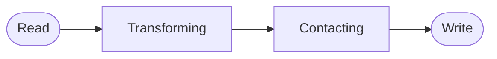
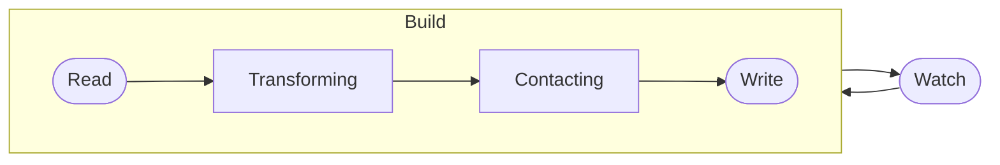

# New Ways to Vue

<p text="2xl" class="!leading-8">
How the new tools and techniques affect<br>the way we <b>view</b> and build applications
</p>

<div class="uppercase tracking-widest" m="t-10">
Anthony Fu
</div>

<div class="abs-br mx-14 my-12 flex">
  <logos:vue text="3xl"/>
  <div class="ml-3 flex flex-col text-left gap-1">
    <div>Vue.js London</div>
    <div class="text-sm opacity-50">Oct. 20th, 2021</div>
  </div>
</div>

---
layout: 'intro'
---

<h1 text="!5xl">Anthony Fu</h1>

<div class="leading-8 opacity-80">
Vue & Vite core team member.<br>
Creator of Slidev, VueUse, Vitesse, Type Challenges, etc.<br>
Fanatical open sourceror. Working at <a href="https://nuxtlabs.com" target="_blank">NuxtLabs</a>.<br>
</div>

<div class="my-10 grid grid-cols-[40px,1fr] w-min gap-y-4">
  <ri-github-line class="opacity-50"/>
  <div><a href="https://github.com/antfu" target="_blank">antfu</a></div>
  <ri-twitter-line class="opacity-50"/>
  <div><a href="https://twitter.com/antfu7" target="_blank">antfu7</a></div>
  <ri-user-3-line class="opacity-50"/>
  <div><a href="https://antfu.me" target="_blank">antfu.me</a></div>
</div>


---
name: Sponsors
layout: center
---

<br>
<div class="text-center text-xs opacity-50 -mt-12 hover:opacity-100">
  <a href="https://github.com/sponsors/antfu" target="_blank">
    Sponsor me at GitHub
  </a>
</div>

---
layout: center
---

# New Ways to Vue <logos-vue />

---

# The Vue 2 Ways

<div grid="~ cols-2" class="gap-10">

```html
<template>
  <!-- -->
</template>

<script>
import Vue from 'vue'
import Foo from './components/Foo.vue'
import { mixinBar } from './mixins/bar'

export default Vue.extend({
  components: {
    Foo,
    // ...
  },
  mixins: {
    mixinBar,
    // ...
  },
  data() {
    return {
      // ...
    }
  },
  methods: {
    // ...
  },
  created() {
    // ...
  },
  destroyed() {
    // ...
  }
})
</script>
```

<div>

###### The Problem

<v-clicks>

- "Scaffolding code" for each component
- Extensibility
- TypeScript support

</v-clicks>

</div>

</div>

---
clicks: 3
---

# Composition API

<div grid="~ cols-2 gap-x-4 gap-y-2">

###### Options API
###### Composition API

```js {all|all|2,8,12,16}
export default {
  data() {
    return {
      dark: false,
      media: matchMedia('(prefers-color-scheme: dark)')
    }
  },
  methods: {
    toggleDark() { this.dark = !this.dark },
    update() { this.dark = this.media.matches }
  },
  created() {
    this.media.addEventListener('change', this.update)
    this.update()
  },
  destroyed() {
    this.media.removeEventListener('change', this.update)
  }
}
```

<div v-show="$clicks >= 1">

```js {*|*|3|3,11} {at:0}
import { onUnmounted, ref } from 'vue'
export default {
  setup() {
    const media = matchMedia('(prefers-color-scheme: dark)')
    const dark = ref(media.matches)

    const update = () => dark.value = media.matches
    const toggleDark = () => dark.value = !dark.value

    media.addEventListener('change', update)
    onUnmounted(() => {
      media.removeEventListener('change', update)
    })

    return { dark, toggleDark }
  }
}
```

</div>

</div>

---
clicks: 2
---

# Composability

<div grid="~ cols-2 gap-x-2">

<div>
<div v-show="$clicks < 2">

```js
import { onUnmounted, ref } from 'vue'

export default {
  setup() {
    const media = matchMedia('(prefers-color-scheme: dark)')
    const dark = ref(media.matches)

    const update = () => dark.value = media.matches
    const toggleDark = () => dark.value = !dark.value

    media.addEventListener('change', update)
    onUnmounted(() => {
      media.removeEventListener('change', update)
    })

    return { dark, toggleDark }
  }
}
```

</div>
<div v-show="$clicks >= 2">

```js
import { useDark } from './useDark'

export default {
  setup() {
    return {
      ...useDark()
    }
  }
}
```

</div>
</div>

<div v-show="$clicks >= 1">

```ts
import { onUnmounted, ref } from 'vue'

export function useDark() {
  const media = matchMedia('(prefers-color-scheme: dark)')
  const dark = ref(media.matches)

  const update = () => dark.value = media.matches
  const toggleDark = () => dark.value = !dark.value

  media.addEventListener('change', update)
  onUnmounted(() => {
    media.removeEventListener('change', update)
  })
  return { dark, toggleDark }
}
```

</div>

</div>

---
clicks: 2
---

# `<script setup>` syntax

<div grid="~ cols-2 gap-x-4 gap-y-2">

##### `<script>`

##### `<script setup>`

```html {all|3,9-14}
<script>
import { ref, computed } from 'vue'
import MyButton from './MyButton.vue'
export default {
  components: {
    MyButton,
  },
  setup() {
    const counter = ref(0)
    const doubled = computed(() => counter.value * 2)

    function inc() {
      counter.value += 1
    }

    return { counter, doubled, inc }
  }
}
</script>
```

<div v-show="$clicks > 1">

```html
<script setup>
import { ref, computed } from 'vue'
import MyButton from './MyButton.vue'

const counter = ref(0)
const doubled = computed(() => counter.value * 2)

function inc() {
  counter.value += 1
}
</script>
```

<div p="y-4 x-2">

- Variables, functions, and components are directly available in the template
- Now stable in Vue 3.2

</div>

</div>

</div>

---
clicks: 2
---

# `v-bind()` in `<style>`

<div grid="~ cols-2 gap-x-4 gap-y-2">

###### without

###### with v-bind()

```html {*|*|2,9-13} {at: 0}
<template>
  <button :style="{ color: buttonColor }">
    My Button
  </button>
</template>

<script>
export default {
  data() {
    return {
      buttonColor: 'green'
    }
  }
}
</script>

<style>
button {
  border-radius: 4px;
}
</style>
```

<div v-show="$clicks >= 1">

```html {*|*|6,12} {at: 0}
<template>
  <button>My Button</button>
</template>

<script setup>
const buttonColor = ref('green')
</script>

<style>
button {
  border-radius: 4px;
  color: v-bind(buttonColor);
}
</style>
```

</div>
</div>

---
disabled: true
---

# Ref Sugar <sup opacity="75">in RFC</sup>

<div grid="~ cols-2 gap-x-4 gap-y-2">

###### without

###### with Ref Sugar

```js
import { computed, ref } from 'vue'

const count = ref(0)
const double = computed(() => count.value * 2)

function inc() {
  count.value = count.value + 1
}
```

```js
let count = $ref(0)
const double = $computed(() => count * 2)

function inc() {
  count++
}
```

</div>

<div pt="10"></div>

- Declare reactive variables from refs using `$()` (`refs -> vars`)
- Get the underlying refs from reactive variables with `$$()` (`vars -> refs`)
- Most commonly used APIs have convenience shorthands (`$ref`, `$computed` & `$shallowRef`)

<div pt="6"></div>

Details in the [RFC](https://github.com/vuejs/rfcs/discussions/369)

---
disabled: true
---

# What have we done in Vue 3?

<div class="pt-4" />

<transform scale="1.2">
<v-clicks>

- Composition API
  - Composblity
  - Better TypeScript support
- More compile-time optimization
  - VNode hoisting
  - Patch flags
  - Syntax sugars
  - Better performance
  - Better DX

</v-clicks>
</transform>

<style>
ul {
  @apply mb-4;
}
</style>

---
layout: center
class: text-center
---

# The New Default Tooling - Vite

<div text="center 9xl" m="t-8">
  <logos-vitejs /> + <logos-vue class="transform translate-y-6px" m="-l-2"/>
</div>

---
layout: center
---

# What's Vite?

---
disabled: true
---

# Task Runners

<div flex="~" position="absolute top-10 right-10" gap="4" text="center">
<div flex="~ col">
<logos-gulp text="5xl" m="auto b-2"/>
Gulp
</div>
<div flex="~ col">
<logos-grunt text="5xl" m="auto b-2"/>
Grunt
</div>
</div>

###### Build

Commonly designed to be used with a single command



<div m="t-8"/>

###### Watch

Apply a watcher to **rerun the whole build process**.<br>Requires to refresh the page to see the changes.



---

# Bundlers

<div flex="~" position="absolute top-10 right-10" gap="4" text="center">
<div flex="~ col">
<logos-webpack text="5xl" m="auto b-2"/>
Webpack
</div>
<div flex="~ col">
<logos-rollup text="5xl" m="auto b-2"/>
Rollup
</div>
</div>

<div m="t-8"/>

<div class="grid grid-cols-[310px,1fr] gap-4">
<div v-click>

###### Build First

- Designed for production build first
- Need to bundle the entire project to start the dev server
- Complex configuration
- HMR gets slower as projects grow

</div>


</div>

---

# Dev Servers

<div flex="~" position="absolute top-10 right-10" gap="4" text="center">
<div flex="~ col">
<logos-snowpack text="5xl" m="auto b-2" dark="filter invert" />
Snowpack
</div>
<div flex="~ col">
<logos-vitejs text="5xl" m="auto b-2"/>
Vite
</div>
</div>

<div m="t-8"/>
<div class="grid grid-cols-[300px,1fr]">
<div v-click>

###### Dev First

- Design for Web development
- Native ESM + Unbundled
- Server ready immediately
- On-demand
- Instant HMR
- ...much more!

</div>


</div>

---
layout: center
---

# What do Vue 3 and Vite bring to us?

<p v-click>Better performance and better DX</p>

---
layout: center
---

# New Ways to View <twemoji-eyes />

<!--
Not only do they bring better performance, but they also provide some new ways to view how we think about the DX on Vue
-->

---
clicks: 4
---

# Using Components

<div grid="~ cols-2 gap-x-8">

```html {*|9-12|14-19|1-7|*}
<template>
  <my-container>
    <my-button />
    <my-input />
  </my-container>
</template>

<script>
import MyContainer from '../components/MyContainer.vue'
import MyButton from '../components/MyButton.vue'
import MyInput from '../components/MyInput.vue'

export default {
  components: {
    MyContainer,
    MyButton,
    MyInput,
  }
}
</script>
```

<div>

<div v-if="$clicks >= 1">

###### To Use a Component

<v-clicks fade :at="1">

- Import and name it
- Register the component
- Use it in the template

</v-clicks>
</div>
<div v-if="$clicks >= 4">

###### The Problem

- Verbose
- Names are repeated at least 4 times

</div>
</div>
</div>

<!--
So let's take a look at how we used to use components in Vue: TODO:.....

One that worth mentioning is that while are you actually register the components globally, the drawback of global registration is that you will lose the ability to code splitting and TypeScript support.
-->

---

# Using Components

<div grid="~ cols-2 gap-x-8">

```html
<template>
  <my-container>
    <my-button />
    <my-input />
  </my-container>
</template>

<script setup>
import MyContainer from '../components/MyContainer.vue'
import MyButton from '../components/MyButton.vue'
import MyInput from '../components/MyInput.vue'
</script>
```

<div>

<v-click>

###### With `<script setup>`

- Imports will be available directly in the template
- No longer need to register the components

</v-click>
<v-click>

###### But...

- The name is still repeated 3 times

</v-click>

</div>
</div>

<!--
As we mentioned before, the new `<script setup>` syntax allows you to
-->

---

# Components Auto Importing

<RepoFixed name="antfu/vite-plugin-components"/>

<div grid="~ gap-x-8" class="grid-cols-[300px,1fr]">

<div>

Using <Repo name="antfu/vite-plugin-components" ml="1" hide-owner/>

```html
<template>
  <my-container>
    <my-button />
    <my-input />
  </my-container>
</template>
```

<br>

#### That's it!

</div>

<div>
<div v-click>

###### How?

- **Compile-time** components resolving
- Components auto-discovery under `src/components` directory

</div>
<div v-click>

###### Differences from Global Registration

- Code-splitting
- No manual registration
- Skipped runtime resolving

</div>
</div>
</div>

---

# How the compilation work

```html
<template>
  <my-container>
    <my-button />
    <my-input />
  </my-container>
</template>
```

<v-click>

Will be compiled by `@vue/sfc-compiler` to (Could inspect via https://sfc.vuejs.org)

```ts {all|3-5}
import { resolveComponent as _resolveComponent } from 'vue'
function render(_ctx, _cache) {
  const _component_my_button = _resolveComponent('my-button')
  const _component_my_input = _resolveComponent('my-input')
  const _component_my_container = _resolveComponent('my-container')

  return (_openBlock(), _createBlock(_component_my_container, null, {
    default: _withCtx(() => [
      _createVNode(_component_my_button),
      _createVNode(_component_my_input)
    ]),
    _: 1 /* STABLE */
  }))
}
```

</v-click>

---
clicks: 5
---

# Write the Vite plugin

<div grid="~ cols-2 gap-x-8">

```ts {*|5|6|7-8|10-16} {at: 0}
// vite.config.ts
export default {
  plugins: [{
    name: 'my-plugin',
    enforce: 'post',
    transform(code, id) {
      if (!id.endsWith('.vue'))
        return

      return code.replace(
        /_resolveComponent\("(.+?)"/g,
        (_, name) => {
          const component = findComponent(name)
          // inject import for component
          return component.path
        }
      )
    }
  }]
}
```

<div>

<v-clicks fade :at="1">

- Use `enforce: post` to ensure the plugin runs after Vue's compilation
- Use `transform` hook to modify the code
- Filter out files that are not Vue
- Replace the `_resolveComponent` usage to real component import

</v-clicks>

<v-click :at="5">
<p p="t-4" opacity="75">
Read <a href="https://vitejs.dev/guide/api-plugin.html" target="_blank">Vite Plugin API Documentation</a> for more
</p>
</v-click>

</div>

</div>

---

# The Result

```ts {4-6}
import { resolveComponent as _resolveComponent } from 'vue'

function render(_ctx, _cache) {
  const _component_my_button = _resolveComponent('my-button')
  const _component_my_input = _resolveComponent('my-input')
  const _component_my_container = _resolveComponent('my-container')

  return () => { /* ... */ }
}
```

After:

```ts {2-4}
import { resolveComponent as _resolveComponent } from 'vue'
import _component_my_button from '../components/MyButton.vue'
import _component_my_input from '../components/MyInput.vue'
import _component_my_container from '../components/MyContainer.vue'

function render(_ctx, _cache) {
  return () => { /* ... */ }
}
```

---

# Inspecting Module Graph

Intermediate state of each transformation

<RepoFixed name="antfu/vite-plugin-inspect" />

<div class="rounded-md overflow-hidden" w="650px">
  <video preload="auto" controls class="w-full -m-1px border-none outline-none p-0" src="https://video.twimg.com/tweet_video/E-9hyKRUYAIYJbI.mp4" type="video/mp4"></video>
</div>

---

# API Auto Importing

<RepoFixed name="antfu/unplugin-auto-import" />

Similarly, we could do auto importing for APIs.

<div grid="~ cols-2 gap-4">

```html
<script setup>
import { ref, computed, watch } from 'vue'
import { debouncedWatch } from '@vueuse/core'

const counter = ref(0)
const doubled = computed(() => counter.value * 2)

debouncedWatch(counter, () => {
  console.log('counter changed')
})
</script>
```

```html
<script setup>
const counter = ref(0)
const doubled = computed(() => counter.value * 2)

debouncedWatch(counter, () => {
  console.log('counter changed')
})
</script>
```

</div>

---
disabled: true
---

# Use Icons

<RepoFixed name="antfu/vite-plugin-icons" v-click="6"/>

<div class="grid grid-cols-[1fr,1.2fr]">
<div>

###### Ways to use icons

<v-clicks>

- Icon fonts
  - Need to pack the entire icon set
  - Flash-of-unstyled-content (FOUC)
- SVG
  - Need to import manually
  - Can't change color when used as images
- Icon components
  - Deps on what the icon set provides
  - Need to register manually

</v-clicks>

</div>

<div>

<v-click>

###### A better solution?

</v-click>
<v-click>

<p text="sm" class="!-mb-4">

Inspired by Vite's on-demand mindset, we could actually bundle the icons at compile-time when as need.

</p>

```html
<script setup>
import MdiAlarm from '~icons/mdi/alarm'
import FaBeer from '~icons/fa/beer'
import TearsOfJoy from '~icons/twemoji/face-with-tears-of-joy'
</script>

<template>
  <MdiAlarm />
  <FaBeer style="color: orange"/>
  <TearsOfJoy/>
</template>
```

</v-click>
<v-click>

<p text="sm" class="!-mb-4">

Powered by [Iconify](https://iconify.design/), we could have **10,000+ icons** from 100+ popular icon sets available in a unified syntax.

</p>

```js
import Icon from '~icons/[collection]/[id]'
```

<p text="sm" class="!-mb-4">

</p>

</v-click>

</div>
</div>

---
clicks: 1
disabled: true
---

# On-demand Icons

<div my="5">

- Only the used icons will be bundled.
- Have almost any icons available to use.
- Directly stylable via `class` and `style`
- SSR / SSG friendly.
- Work with `vite-plugin-components` to have icon fonts liked DX.

</div>

<div v-if="$clicks == 0">

```html
<script setup>
import MdiAlarm from '~icons/mdi/alarm'
import FaBeer from '~icons/fa/beer'
import TearsOfJoy from '~icons/twemoji/face-with-tears-of-joy'
</script>

<template>
  <MdiAlarm />
  <FaBeer style="color: orange"/>
  <TearsOfJoy/>
</template>
```

</div>
<div v-else>

```html
<template>
  <MdiAlarm />
  <FaBeer style="color: orange"/>
  <TearsOfJoy/>
</template>
```

</div>

---
class: flex flex-col
---

<div grid="~ gap-10" h="full" class="grid-cols-[1.8fr,1fr]">
<div>

# Vite Ecosystem

<div mt="5" />

<v-clicks>

<Repo name="antfu/vite-plugin-components" hide-owner/> - Components auto-import

<Repo name="antfu/vite-plugin-auto-import" hide-owner/> - API auto-import

<Repo name="antfu/vite-plugin-icons" hide-owner/> - On-demanded icons solution

<Repo name="antfu/vite-plugin-inspect" hide-owner/> - Inspect intermedia state of Vite

<Repo name="hannoeru/vite-plugin-pages"/> - File-based routing

<Repo name="windicss/vite-plugin-windicss" hide-owner/> - Windi CSS (On-demand Tailwind CSS)

<Repo name="axe-me/vite-plugin-node" /> - Vite HMR for backend Node.js app

<Repo name="anncwb/vite-plugin-style-import" /> - On-demand components style importing

<div mt="10">
...and more
</div>

</v-clicks>

</div>
<div flex="~" h="full">

<div flex="~ col" text="center" m="auto" v-click>


<Repo name="vitejs/awesome-vite" />

</div>
</div>
</div>

---
layout: center
class: text-center
---

<p opacity="50">Vite has inspired many new plugins and better ways to improve DX</p>
<h1 v-click>Bring them to Your Existing Projects</h1>
<div v-click text="green-500 5xl">Today!</div>

---
layout: center
class: text-center
---

<h1 text="!5xl">Introducing <b>unplugin</b></h1>

<h3 v-click opacity="60">A universal plugin interface for Webpack, Vite, Rollup,<br>and more...</h3>

<v-click>

<h3 opacity="60" mt="10">write once and runs on:</h3>

<div class="flex gap-5 text-5xl p-6 -mt-2 -mb-20 place-content-center">
  <logos-webpack text="1.1em" />
  <logos-vitejs />
  <logos-rollup />
  <logos-nuxt-icon />
  <logos-vue />
  <logos-nextjs-icon dark="filter invert" />
</div>

</v-click>

---

# Unplugin

<RepoFixed name="unjs/unplugin" />

<div class="grid grid-cols-2 gap-x-4 gap-y-2">

###### Vite Plugin

###### Unplugin

```ts
export function VitePlugin() {
  return {
    name: 'my-first-unplugin',
    transform(code) {
      return code.replace(
        /<template>/,
        `<template><div>Injected</div>`
      )
    },
  }
}
```

```ts
import { createUnplugin } from 'unplugin'

export const unplugin = createUnplugin(() => {
  return {
    name: 'my-first-unplugin',
    transform(code) {
      return code.replace(
        /<template>/,
        `<template><div>Injected</div>`
      )
    },
  }
})

export const VitePlugin = unplugin.vite
export const RollupPlugin = unplugin.rollup
export const WebpackPlugin = unplugin.webpack
```

</div>

---

# Vite Plugins <carbon-arrow-right /> Unplugins

<v-clicks>

<div>
<code opacity="50">vite-plugin-components</code> <carbon-arrow-right /> <code text="green-400">unplugin-vue-components</code>
  <ul></ul>
</div>

<div>
<code opacity="50">vite-plugin-auto-import</code> <carbon-arrow-right /> <code text="green-400">unplugin-auto-import</code>
  <ul>For <logos-vue/> Vue / <logos-react/> React / <logos-svelte-icon/> Svelte / <logos-javascript/> Vanila / Any framework</ul>
</div>

<div>
<code opacity="50">vite-plugin-icons</code> <carbon-arrow-right /> <code text="green-400">unplugin-icons</code>

<ul class="grid grid-cols-[1fr,40px,1fr,40px,1fr] w-min whitespace-nowrap">

<div class="group">
  <div><logos-vue/> Vue</div>
  <div><logos-react/> React</div>
  <div><logos-preact/> Preact</div>
  <div><logos-svelte-icon/> Svelte</div>
  <div><solid-logo/> SolidJS</div>
  <div><logos-webcomponents/> Web Components</div>
  <div><logos-javascript/> Vanila</div>
  <div>...</div>
</div>
<carbon-add m="auto"/>

<div class="group">
  <div><logos-vitejs/> Vite</div>
  <div><logos-nuxt-icon/> Nuxt</div>
  <div><logos-nextjs-icon class="inline filter invert"/> Next.js</div>
  <div><logos-rollup/> Rollup</div>
  <div><logos-vue/> Vue CLI</div>
  <div><logos-webpack/> Webpack</div>
  <div>...</div>
</div>

<carbon-add m="auto"/>

<div class="group">
  <div><carbon-carbon/> <a href="https://carbondesignsystem.com/guidelines/icons/library/" target="_blank">Carbon Icons</a></div>
  <div><mdi-material-design/> <a href="https://materialdesignicons.com/" target="_blank">Material Design Icons</a></div>
  <div><uim-circle-layer/> <a href="https://iconscout.com/unicons" target="_blank">Unicons</a></div>
  <div><twemoji-star-struck/> <a href="https://github.com/twitter/twemoji" target="_blank">Twemoji</a></div>
  <div><tabler-writing-sign/> <a href="https://tabler-icons.io/" target="_blank">Tabler</a></div>
  <div><bx-bx-planet/> <a href="https://github.com/atisawd/boxicons" target="_blank">BoxIcons</a></div>
  <div><eos-icons:installing/> <a href="https://gitlab.com/SUSE-UIUX/eos-icons" target="_blank">EOS Icons</a></div>
  <div>...</div>
</div>

</ul>
</div>

</v-clicks>

<style>
ul {
  @apply pl-6 mt-2 mb-6 text-sm;
}
.group {
  @apply flex flex-col gap-2 p-4 my-auto;
  @apply border-l-1 border-r-1 border-gray-400/50;
}
</style>

---
layout: center
class: text-center
---

# What about Vue 2?

<p v-click class="text-xl">We got you covered!</p>

---

# Vue 2

<v-click>

###### Polyfills

- Composition API: [`@vue/composition-api`](https://github.com/vuejs/composition-api)
- `<script setup>` & Ref sugar: [`unplugin-vue2-script-setup`](https://github.com/antfu/unplugin-vue2-script-setup)

</v-click>
<v-click>

###### Vite Support

- [`vite-plugin-vue2`](https://github.com/underfin/vite-plugin-vue2)
- [`nuxt-vite`](https://github.com/nuxt/vite)

</v-click>
<v-click>

###### DX Enhancement

- [`unplugin-vue-components`](https://github.com/antfu/unplugin-vue-components)
- [`unplugin-auto-import`](https://github.com/antfu/unplugin-auto-import)
- [`unplugin-icons`](https://github.com/antfu/unplugin-icons)

</v-click>

---

# Sum Up

This is what you could get in Vue 2, Nuxt 2, Vue CLI, Vue 3, Vite:

<div class="grid grid-cols-[1fr,30px,1fr] gap-2">

```html
<template>
  <button>
    <IconSun v-if="dark"/>
    <IconMoon v-else/>
  </button>
</template>

<script>
import IconSun from '@some-icon-set/sun'
import IconMoon from '@some-icon-set/moon'

export default {
  components: {
    IconSun,
    IconMoon,
  },
  data() {
    return {
      dark: false,
      media: matchMedia('(prefers-color-scheme: dark)')
    }
  },
  methods: {
    toggleDark() { this.dark = !this.dark },
    update() { this.dark = this.media.matches }
  },
  created() {
    this.media.addEventListener('change', this.update)
    this.update()
  },
  destroyed() {
    this.media.removeEventListener('change', this.update)
  }
}
</script>
```

<div class="flex" h="50">
  <carbon-arrow-right m="auto" opacity="50"/>
</div>

<div>

```html
<script setup>
const dark = useDark()
</script>

<template>
  <button>
    <IconSun v-if="dark"/>
    <IconMoon v-else/>
  </button>
</template>
```

</div>

</div>

---

# Starter Templates

Project templates that have plugins mentioned previously

<div grid="~ gap-6" class="pt-6 grid-cols-[200px,1fr]">

<Repo name="antfu/vitesse" m="y-auto"/>
<div m="y-auto">Opinionated Vue 3 + Vite Starter template</div>

<Repo name="antfu/vitesse-nuxt" m="y-auto"/>
<div m="y-auto">Vitesse experience on Nuxt 2</div>

<Repo name="antfu/vitesse-webext" m="y-auto"/>
<div m="y-auto">Vitesse for Web Extensions</div>

</div>

<div m="t-10" v-click>

###### Try it now!

<div m="p-2" />

```bash
npx degit antfu/vitesse
```

</div>

<div v-click p="t-10">

Spoiler: Nuxt 3 will have many of these features built-in directly.

</div>

---
layout: center
class: 'text-center pb-5'
---

# Thank You!

Slides can be found on [antfu.me](https://antfu.me)
